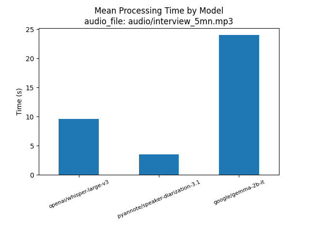
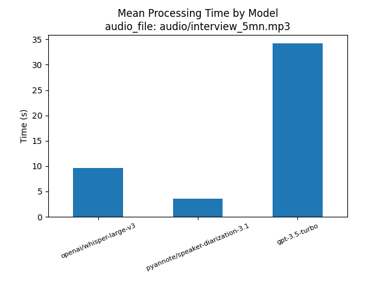

# Evaluation of Text Summarization Models

In this document, we compare the performance of two language models for text summarization: Gemma and GPT. We evaluate the models based on the quality of the generated summaries and the time taken to generate the summaries.

## Model 1: Gemma

The Gemma model generated the summary found in [this report](reports/gemma_report_5mn_output.md).

The time taken by the Gemma model to generate the summary is shown in the figure below:

## Model 2: GPT

The GPT model generated the summary found in [this report](reports/gpt_report_5_mn_output.md).

The time taken by the GPT model to generate the summary is shown in the figure below:

## Comparison

In the following sections, we compare the Gemma and GPT models based on various evaluation criteria. Please refer to the individual reports for the generated summaries.

### Clarity

...

### Accuracy

...

### Completeness

...

(Continue with the rest of your evaluation criteria)
