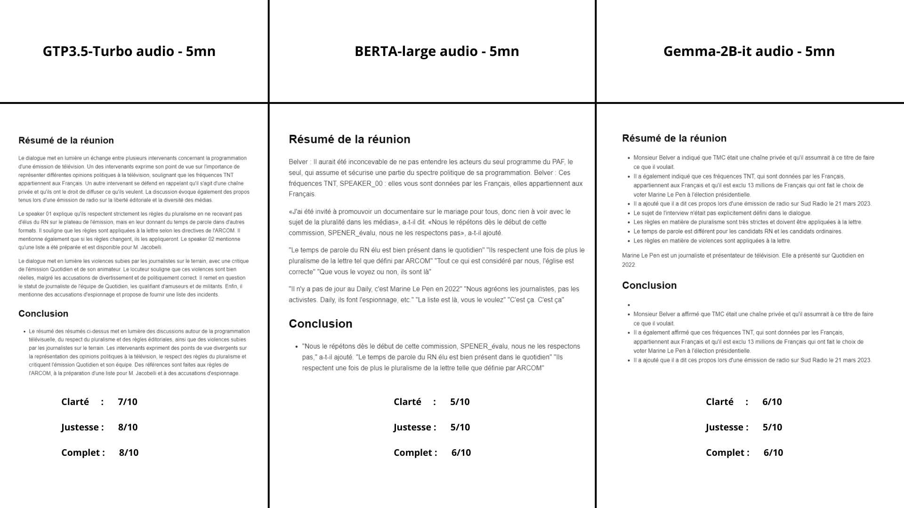

# Evaluation of Text Summarization Models

In this document, we compare the performance of two language models for text summarization: Gemma and GPT. We evaluate the models based on the quality of the generated summaries and the time taken to generate the summaries.

## Model 1: Gemma

The Gemma model generated the summary found in [this report](reports/gemma-interview_5mn_report_output_0.md).

## Model 2: GPT

The GPT model generated the summary found in [this report](reports/gpt-interview_5mn_report_output_0.md).

## Model 2: BART

The BART summary model generated the summary found in [this report](reports/bart-interview_5mn_report_output_1.md).

## Comparison

In the following sections, we compare the Gemma and GPT models based on various evaluation criteria. Please refer to the individual reports for the generated summaries.

(Continue with the rest of your evaluation criteria)
