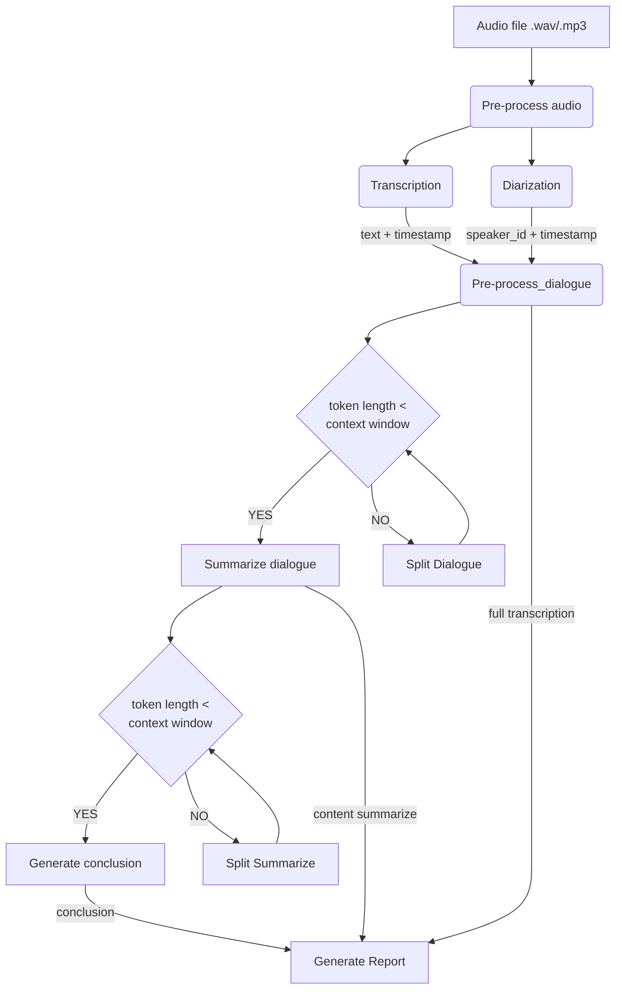

# AI Report Maker

**AI Report Maker** is a powerful tool designed to automate the process of transcribing and **summarizing meetings**. It leverages state-of-the-art machine learning models to provide detailed and accurate reports.

Here's a brief overview of how it works:

1. **Transcription**: AI Report Maker uses the [`Whisper Large v3`](https://huggingface.co/openai/whisper-large-v3) model for automatic speech recognition. It transcribes the audio recording of a meeting into text.

2. **Speaker Diarization**: The program identifies different speakers in the audio file, providing a clear context for the transcription. [`Pyannote.v3`](https://huggingface.co/pyannote/speaker-diarization-3.1) model use for diarization

3. **Annotated Transcription**: The transcriptions are combined with the speaker diarization to generate a full annotated transcription. This includes timestamps, speaker identities, and the transcribed text.

4. **Sub-Summary Generation**: The dialogue is processed using a Language Model of the user's choice (`openai-GPT3.5`, `GEMMA`, `MISTRAL`, `BART`). This generates a sub-summary for each speaker.

5. **Conclusion Generation**: The sub-summaries are further processed in the same Language Model to generate a comprehensive conclusion for the meeting.

With AI Report Maker, you can transform lengthy meetings into concise, easy-to-read reports.

## Table of Contents

- [AI Report Maker](#ai-report-maker)
- [Flow-Chart](#flow-chart)
- [Features](#features)
- [Installation](#installation)
  - [Language Model Requirements and Specifications](#language-model-requirements-and-specifications)
- [Usage](#usage)
- [Evaluation](#evaluation)
- [Contributing](#contributing)
- [License](#license)

## Flow-Chart


## Features

### actual
- Language supported: French only at the moment
- Automatic Speech Recognition with timestamps
- Speaker Diarization with timestamps
- Generate an annotated transcription with timestamps, speakers, and text
- Generate multiple sub-summary of the dialogues
- Generate a conclusion for the meeting
- Generate a report in markdown format with the annotated transcription, sub-summary, and conclusion

### next
- Multilanguage support
- Add more Language Models to generate sub-summary and conclusion (**camembert** nlp model for french text seems promising)
- Add a GUI to interact with the program
- Automatic speaker naming and identification
- Extraction of important moments of the meeting from the audio file
- Extraction of Topics discussed in the meeting
- Sentiment analysis of the meeting
- Generate a report in different formats (pdf, docx, etc.)
- Generate report illustrations

## Installation

1. Clone the repository.
2. create a virtual environment.
2. Install the dependencies with `pip install -r requirements.txt`
3. Set up your environment variables for the *Hugging Face* and *OpenAI* API keys. In root directory create a **.env** file :
```.env
HUGGING_FACE=your_token_here
OPENAI_KEY=sk-your_token_here
```
4. run this command in the terminal `python -m spacy download fr_core_news_lg` to download french **NLP** model and `python -m spacy download fr_dep_news_trf`.

5. If you want to use Mistral_AI you will need to Install `llama_cpp` according to the instructions on its [official documentation](https://link-to-llama-cpp-docs). Note: The installation of `llama_cpp` may vary depending on your distribution and whether you have a CUDA-enabled GPU.

### Language Model Requirements and Specifications

This project uses several language models, each with its own requirements and specifications:

- **GPT3.5-Turbo**: It is not open-source and no free tier, This model is gated with openai credentials.

- **GEMMA-2B/7B**: It is an open-source model and free tier but gated model via hugging face credentials.

- **MISTRAL-7B**: Local LLM compute with llama_cpp

- **BART**: this is a summarize model made by facebook, it is open source, free. quite good but only handle english.

Please refer to the official documentation of each model for more detailed information and instructions on how to use them.

## Usage

Run the `main.py` script with your audio file, mode and llm as an argument.`--mode` is either `prod` (by default) for basic executions or `dev` for logs and benchmark. Argument `--lm` is to choose wich large language to use, at the moment you can choose 3:

- `gpt` based on gpt-3.5-turbo, **Not free but fast speed and highest performance**.
- `mistral` based on the quantinze 4bits version of mistral-7b-instruct, **slow speed and poor performance**.
- `gemma-7b` based on gemma-7b-it, **average speed but low performance**.
- `gemma-2b` based on gemma-2b-it, **fast speed but poor performance**.
- `bart` based on bart-large-cnn **slow speed and ok performance on longer meeting**.
```bash
python main.py /path/to/your/audio/file --mode dev --llm gemma-2b
```

This will generate a report in markdown format in the `report` directory.

## Evaluation


There is **no metrics** to benchmark the result of the report generation. So a **website** is made as a platform for the **evaluation form**. The form automatically **collect responses and provide a way to view them**. Feel free to check the **online form: [eval-app website](https://eval-app.online/)  to start rating the **Report Maker**

**Manual Evaluation**: Have human evaluators rate the quality of the summaries. This can be time-consuming but can provide valuable insights into aspects like coherence and relevance that automated metrics might miss.

more details at [Evaluation_docs](Evaluation/readme.md).
latest evaluation result [Evaluation résult](Evaluation/evaluation.md)

## Contributing

Pull requests are welcome. For major changes, please open an issue first to discuss what you would like to change.

## License

[MIT](https://choosealicense.com/licenses/mit/)

